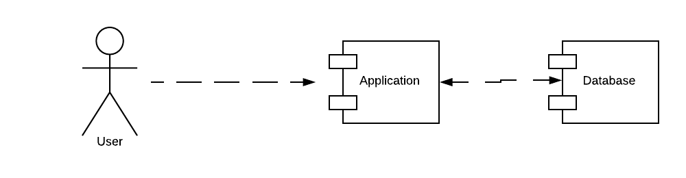
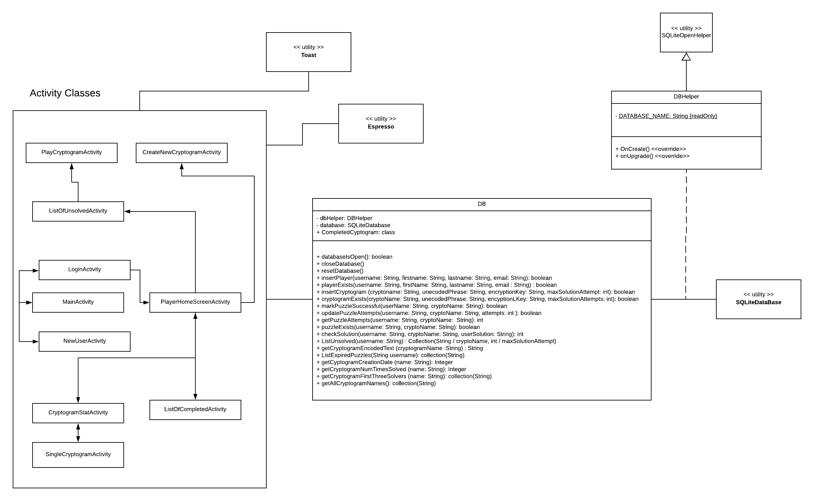
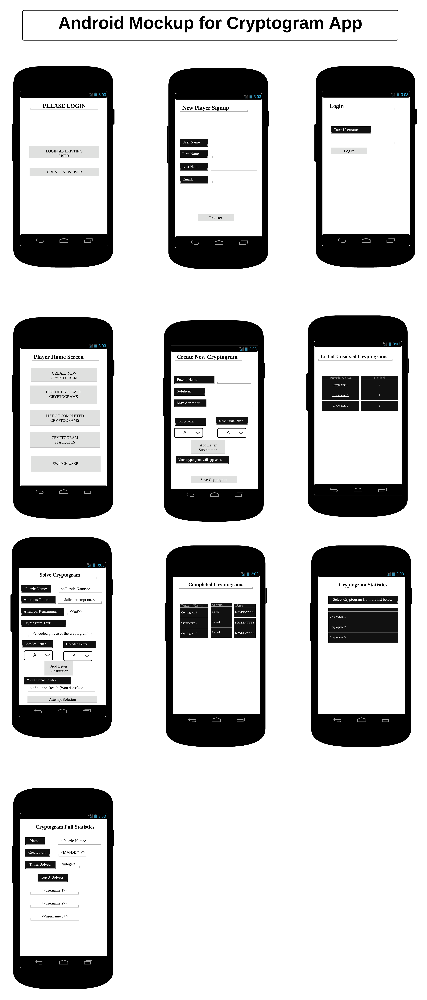

# Design Document

**Authors**: Rushabh Bhansali, Rob Sylvester (Team 48)
##### Version 2

## 1 Design Considerations

This Android Application is intended to run smoothly on the Android version 6.0. The design should make the application to be as simple and lightweight as possible. The substitution cipher presentation needs to be intuitive, and the design should be mostly minimalist to support abstracting away the logic mostly behind the scenes and to keep the interface simple, especially for compatibility with all types of phones.

### 1.1 Assumptions

1. The Design assumes that the user is familiar with basic knoweledge about an Android Application usage and interactions. In particular, the user is expected to know how to launch an application if using a physical device, and how to use the back button.
1. The application is targeted to run on an Android version 6.0 and above and the user accessing the application should have permission to write data to the SQLLite database on which this application is running.
1. The application is designed to run independently. It will not communicate with any other application in the targeted device. The Android operating system should allow the application to be installed and access the required resources. The application is not expected to be run if any permission is denied.
1. The application is designed to store user data on the device memory. The access to the external memory is not integrated in the application design at the time.
1. he application is developed at a minimum sdk 23 and target sdk 26. 
1. Finally, it should be stressed that the bulk of the activity tests in the application run on Android espresso, runner, and rule, so it is assumed that for testing purposes that these tools are present in Android Studio or any other IDE. This makes usage of mocking interactions much easier.

### 1.2 Constraints

Since the Application is designed to be run primarily on an android device with limited size screen, the amount of user interactions are limited on a specific screen. This constraint is highlighted in the GUI mockup of the design. You will notice that the majority of the activities hold between 3-5 components on screen, and they are mostly just simple text views or buttons to navigate between activities.

In addition to this, the logic of the application is heavily abstracted away in a database. While the application likely will never run into memory issues with respect to the size of this database, it should be noted that if the database is never cleared (and it is), or if thousands upon thousands of users and cryptograms get created, things might begin to slow down.

### 1.3 System Environment

The Application is designed for the Android devices running Android version 6.0 and up. Again, we target SDK 26 with a minimum SDK 23. The user interaction with the app is touch-based, so the application is expected to be run on a touch screen device. The GUI of the app is primarily targeted for Standerd size mobile devices (upto about 6.0 inch). The Scaling of the App for larger screen devices such as tablet may not be intuitive for the user. However, the application is still expected to be functional in the large screen devices. This means that we can heavily make use of relative layouts, as well as constraint layouts in certain cases, so that we can define UI components in such a way that they will be visually appealing on all devices and the UI will appear as smooth as possible.
 
## 2 Architectural Design

### 2.1 Component Diagram

Since all the application components are based locally on the device, a simple component diagram below sums up the simple three high-level components.
 

The application itself consists of primarily activities, and these activities control UI interaction and access to the database. There are tentatively planned to be 10 activities in total, but this may increase to 11 depending on how we handle the statistics that are viewed for individual cryptograms. The database will be abstracted away from the activity logic through a database API. 

### 2.2 Deployment Diagram

All the components of the system are deployed locally on the device. The deployment diagram is unnecessary. That being said, we should state that the database itself is a SQLite database, which is accessed through android.database.sqllite. On the actual Android device filesystem, these files are stored away in /data/data/<packagename>/databases

## 3 Low-Level Design

The Application consists mainly of 2 components, the code base (Activity files) and the database. There are also, of course, a few hundred tests too for each of these components. The database lives in a single file, as do its tests, and each Activity file has its own Espresso test. 

The class structure of the Codebase is depicted in the class diagram in the next section. The database is used to store user data and game data that is shared among all the users. We can now walk through these two components and break down their individual components, and what they are, and how they interact. Refer to the list that follows alongside the mockups that come in section 4.

#### Code Base (List of Activities)
1. **Main** - The landing page for the application. Users cannot work with cryptograms until they login. This means that they either login as an existing player, or create an account, and then login with that account.
2. **Login** - Once a user has created an account, they enter their account name and login. There are no authentication systems present here. Simply enter a valid username and you will be taken to the home screen, otherwise an appropriate error message will be shown.
3. **Create Player** - Users create players by entering a unique username, as well as some other basic info. This creates an entry in the 'players' database table, and promptly brings the player to the login page.
4. **Player Home Screen** - Players that are logged in use this as sort of a home base. From here, they can create cryptograms, solve cryptograms, list their unsolved/solved cryptograms, see statistics for cryptograms, or switch users. So think of this like a set of buttons that will lead to each of these respective five activities, which is, well, exactly what the mockup shows.
5. **Create Cryptograms** - A cryptogram must be created by a user before another user can play it, and of course you can play your own cryptogram, an endeavor that might be exciting to someone with severe Alzheimer's. Nonetheless, cryptogram creation will insert cryptograms into the database just like player creation inserted into the player database. Cryptogram names must be unique. Furthermore, since they use substitution ciphers, the design must verify that cryptograms are indeed solvable. Users choose the character->character mappings, and since players will be presented with encoded phrases, care is taken to verify that cryptograms are solvable before sent to the database. Users of course can view their encoded cryptogram text before it is saved in the database.
6. **View Unsolved Cryptgorams** - This is simply a table of cryptograms that are yet to be solved by players. Clicking on an unsolved cryptogram brings you to the cryptogram solver. Note that if you fail to solve a cryptogram in the specified number of attempts by its creator, it will leave the unsolved table and enter the completed table.
7. **Play Cryptogram** - Similar to the create cryptogram model and view, this is where players work in reverse order by working with an encoded phrase and entering the character->character mappings for the solution phrase. When a user first attempts a solution, an entry is creating in the puzzles table that stores information on the many:many mapping of users and cryptograms to the puzzles table. This makes it easy to store when and if cryptograms are solved, how many attempts there have been, and who has attempted which cryptograms.
8. **View Completed Cryptograms** - This table is similar to the unsolved cryptograms, except you can't play them anymore (unless you make a new username). This stores the result of whether or not you actually solved it, as well as the time (if applicable) of when you did solve the cryptogram.
9. **View Statistics** - This is where you get a table of all cryptograms, and if you click on one of them in this table, ordered by creation date, you'll be brought to...
10. **View Statistics (Individual Cryptogram)** - This is where you get to see full stats for a given cryptogram, including when it was created, how many times it has been solved, and who the first three solvers were.

#### Database
1. **players table** - This will store the usernames of players and other information to control entry into the application for playing cryptograms and loading the tables properly.
1. **cryptograms table** - This will store the cryptogram info, mainly the name, and the encoded and decoded strings.
1. **puzzles table** - This will store how individual players are doing solving individual cryptograms. Between these three tables, we have everything we need to drive the logic of the application without really individual classes for the cryptograms, players and puzzles.

Note that the Database itself will have a rich API that will have method calls for such things as playerExists(username), checkSolution(cryptogramName, solutionPhrase), and more. This API will allow for the activity logic to be simpler to follow, and allow for better unit testing on the database side of things. 

### 3.1 Class Diagram

The following Class diagram represents the static class structure for the components of the Application and their relationships.
 

## 4 User Interface Design

The following image displays the graphical mockup of the User Interface. There are ten different Views in the App. All the specified user interactions are covered in these ten views. This mockup describes type of interaction on each view of the app, however the final decision regarding the format of these elements will be moved around during the final phase of the application.

