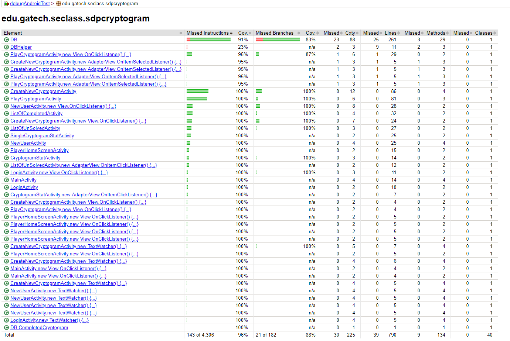

# Test Plan
**Author**: Team 48
## 1. Testing Strategy
### 1.1 Overall strategy
The android application ‘SDPCryptogram’, will heavily abstract away the logic into database calls to android’s SQLite provider. We can think of the application consisting mostly of database utility functions, and activity files that are responsible for the user interface and interacting with these database functions.
The database functions present in DB.java will be the inspiration for the unit tests that are currently present in DatabaseTest.java. These unit tests will make sure to test each function in the file and each possible return value for these functions. Likewise, we aim to cover the branches in these methods so that we have the highest statement and branch coverage as possible.
The activity files will test the user interactions as well as the application logic outside of the database. This is where we can test system and integration tests, via Espresso. We can test the interactions with the database as part of interacting with the UI, test error messages, test transitions to activities, and all other application logic outside of the database. Likewise, we can easily run our regression tests when we change something in the Database or other activity files by running the full activity suite. The nice thing about this strategy is that it involves the easy use of a full end-to-end test script that creates multiple users, multiple cryptograms, tests all the displays, etc.
Rob will be responsible for the activity tests and the basic skeleton of the database tests, while Chris, Rushabh and Jason will finish the many, many unit tests present in the DatabaseTest file.

We can think of the basic tests as falling into seven categories:
1. Creating a player
2. Logging in as a player
3. Creating a cryptogram
4. Solving a cryptogram
5. Viewing lists of completed cryptograms
6. Viewing lists of unsolved cryptograms
7. Viewing the statistics of cryptograms

Each of these seven categories contains its own unique activity file, and several database calls, all of which will need to be tested. The unit tests break down the individual functions in the database.

Development of the application will be performed on computer systems using IDE “Android Studio”. But, to ensure reliable performance of the App on the mobile device the App will be installed on an actual android device and tested for unusual behaviour on the device. Some of these behaviour criteria to be tested includes unusual battery drain because of the App, unnecessary permission request for the app, the abrupt crash of the app, smooth transition of the app between different device orientation etc. It should be specified that the application is targeted at a Android SDK 26, with a minimum of 23. 

During regression testing, the features of the of the app that are vital for the user experience and performance will be tested. Also, during the future releases of the App, the complete set of database and activity tests will be performed to prevent the new bugs from creeping up in the code. During regression testing, special emphasis will be given to the testing of old bugs to make sure old, previously fixed issues do not reappear.

Finally, Unit tests will be prepared and executed during implementation by the developer of the specific code. To ensure thorough testing of the app on different devices, all the team members will be downloading the app on their devices and perform the function and system tests.

### 1.2 Test Selection

Testing the database with unit tests consists of both black-box and white-box testing techniques. We will rely on the strategy of identifying boundary values with respect to category partitions so that we can know which are the proper types of inputs to test for our unit tests. By using the table creation statements for cryptograms, puzzles and players, we have a very food idea of what category partition values need to be tested. For example, since players need to have unique usernames, and these usernames need to be of >= 1 character, we will need unit tests for repetitive usernames, usernames of 0 characters, usernames of 1 characters, and usernames of 2+ characters. Similar strategies can be implored for other fields in the database tables, and the logic of DB.java that interacts with table creation, updates, and select statements as per the requirements outlined in Assignment 5.

White-box testing will be a smaller, but useful component to the unit tests as well. The DB plans to be written with as little coupling as possible, so branch and statement coverage techniques should be easy to verify. We will also verify in our unit tests each of the possible return values, primarily for success and failure, for the database calls. Similar strategies are used in the activity files.

Functional tests, system tests, and integration tests will be done by users across various Android devices, and these primarily rely on black-box testing techniques. Espresso makes it easy for us to utilize the model-based testing that was outlined in the black-box testing lecture. Specifically, we plan to follow the pipeline from functional requirements -> independently testable features -> relevant inputs -> test case specifications -> test cases. This will be greatly useful for the activity tests because this means we will be able outline the use cases and tests in parallel. 

Any end-to-end tests will follow a pipeline that integrates much of the activity testing in a logical order so that we can test a full use case in Espresso. This will be a great possibility for a full system test and regression test to run on multiple Android systems. 

### 1.3 Adequacy Criterion
The unit tests will ensure the accuracy of individual methods and classes of the code, but primarily the database. However, the overall quality of the App will be ensured by implementing multiple test cases during the functional, integration and system testing. The test cases will test for both functions of the app activities, the error messages, the . This will minimize the possibility of bugs in the system. The following criteria will be considered for maximum code coverage during various stages of testing.

#### 1.3.1 Statement coverage and Input Partitioning:
Because the program logic is essentially split because database functionality and activity files, we can test these with statement coverage metrics quite easily. For each database table schema, we can generate and test the boundary inputs for each of the table creation statements. We will need select statements for all three tables, and insert statements as well. One benefit of this is that we can test the inserts and select statements together.

Input partitioning is key here. This follows the constraints of the tables to know that we are covering the boundaries properly. Likewise, this strategy can be used to test, for instance, the number of attempts remaining on a given cryptogram for a user.

#### 1.3.1 Branch coverage: 
The test suite should cover all the branches or condition statements of the program in both the activity files as well as the database calls. Jacoco Framework is used to generate automatic coverage report with statistics about branch coverage and statement coverage. 

### 1.4 Bug Tracking
Our team plans to use the “Issues” functionality supplied in GitHub for bug and issue tracking. We found however, after a few days of development, that a separate google docs file ended up being a better way to coordinate together.

### 1.5 Technology
We will need a number of Android technologies for testing:
JUnit for Unit Testing of DB and some activity methods.
Hamcrest for some core library string operations.
Android Espresso for Functional Testing and much of the UI testing, and end-to-end tests.
Android Rule for Activity testing help.
Android Instrumentation Registry for default Context support
Android Runner for Activity testing help.
Jococp Framework for Test Coverage Reports.

## 2. Test Cases

#### Automated Functional Tests:
The functional tests in this program, as well as the end to end tests, are written in Espresso. When running these tests, you should keep in mind that the database **does not** delete everything before running them. They expect a clean DB. This is because Espresso is literally interacting with the app, and if testing something like a repetitive user name failing, we need a clean database with which to properly test this functionality. The following table outlines each of these activity files, and the tests that are included in their espresso runs. You can verify these yourself by running them from Android studio from the androidtest folder, but make sure your emulator is **turned on**. 

The tests are ordered by activity, with the first for each activity listed in bold. Some method names are split into several lines for more readable table formatting.

| No. | Class | Test | Purpose  | Expected Result | Actual Result | (Pass/Fail) | Notes |
|--------|--------|----------|--------|--------------|--------------|----|---|
|1. | **NewUser ActivityTest** | invalidEmailDisplaysError| This test verifies a new user without an email address properly displays an error message informing the user of the missing field. | Error message appears in text view | Error message appears in text view | Pass | None
|2. | NewUser ActivityTest | invalidFirstNameDisplaysError|This test verifies a new user without a first name properly displays an error message informing the user of the missing field. | Error message appears in text view | Error message appears in text view | Pass | None
|3. | NewUser ActivityTest | invalidUserNameDisplaysError|This test verifies a new user without a username properly displays an error message informing the user of the missing field. | Error message appears in text view | Error message appears in text view | Pass | None
|4. | NewUser ActivityTest | invalidLastNameDisplaysError|This test verifies a new user without a last name properly displays an error message informing the user of the missing field. | Error message appears in text view | Error message appears in text view | Pass | None
|5. | NewUser ActivityTest | repetitiveUserName DisplaysError| This test creates two users, one after the other, with the same username, to verify that an error message appears saying the username was **not unique** | Error message for non-unique username appears in text view | Error message appears in text view | Pass | None
|6. | NewUser ActivityTest | missingEmailDisplaysError|This test verifies a new user without an email address that does not properly conform to **RFC 822** will see a proper error message for an invalid email | Error message for invalid email appears in text view | Error message appears in text view | Pass | None
|7. | NewUser ActivityTest | validUserProperly InsertsIntoDB| This test verifies that when a new user with valid credentials is created, and then can be pulled form the DB with those exact credentials | Successful DB read matches DB write | DB read matches DB write | Pass | DB must be clear!
|8. | **LoginActivityTest** | loginWithNonExisting PlayerGivesError | This test verifies logging in with a username that does not exist fails and displays an error | Invalid username error appears and nobody is logged in | Invalid username error appears and nobody is logged in | Pass | None
|9. | LoginActivityTest | loginWithExisting PlayerTakesUsToHomeScreen | This test verifies logging in with a valid username takes the user to the player home screen | Transitions to player home activity |  Transitions to player home activity | Pass | None
|10. | **CreateNew CryptogramTest** | RepetitiveCryptoname ErrorDisplays | This test verifies that cryptograms with non-unique names will not be inserted into the database, and display an error. | Displays error on textfield |  Displays error on textfieldy | Pass | None
|11. | CreateNew CryptogramTest | SubstitutionDisplayValid | This test verifies that after entering a number of letter->letter substitution mappings, the encoded string appears as expected| Encoded string matches expected |  Encoded string matches expected | Pass | None
|12. | CreateNew CryptogramTest | CryptogramInserts SuccessfullyToDB | This test verifies that, upon making a valid cryptogram, it inserts into the DB and can be read exactly as written | Database read call is successful using all fields just written | Database read call is successful using all fields just written | Pass | None
|13. | CreateNew CryptogramTest | UnsolvableCryptogram NotInsertedIntoDB | This test verifies that when a user attempts to make a cryptogram that has two letters in the string mapping to the same letter, the cryptogram would be unsolvable, and cannot be inserted into the DB, with a toast message popping up with the error. | Not inserted into the DB |   Not inserted into the DB  | Pass | None
|14. | CreateNew CryptogramTest | ZeroAttemptsPhrase DisplaysError | This test verifies that a cryptogram cannot be created with 0 solution attempts | Error is displayed and nothing is inserted into DB | Error is displayed and nothing is inserted into DB | Pass | None
|15. | CreateNew CryptogramTest | MissingSolutionPhrase DisplaysError |This test verifies that a cryptogram cannot be created with a missing solution phrase | Error is displayed and nothing is inserted into DB | Error is displayed and nothing is inserted into DB | Pass | None
|16. | CreateNew CryptogramTest | MissingCryptoName ErrorDisplays | This test verifies that a cryptogram cannot be created with a missing cryptogram puzzle name. | Error is displayed and nothing is inserted into DB | Error is displayed and nothing is inserted into DB | Pass | None
|17.| **ListUnSolved ActivityTest** |newCryptogramName1 AppearsInUnsolvedList | This test verifies that when a user creates a cryptogram, it appears in the unsolved list with 0 failures | Appended to unsolved list with 0 failures| Appended to unsolved list with 0 failures | Pass | Manually verify 0 unsolved
|18. | ListUnSolved ActivityTest | newCryptogramName2 AppearsInUnsolvedList | This test verifies that when a user creates a second cryptogram, it appears in the unsolved list with 0 failures | Appended to unsolved list with 0 failures| Appended to unsolved list with 0 failures | Pass | None
|19. | ListUnSolved ActivityTest | newCryptogramName3 AppearsInUnsolvedList | This test verifies that when a user creates a third cryptogram, it appears in the unsolved list with 0 failures | Appended to unsolved list with 0 failures| Appended to unsolved list with 0 failures | Pass | Further tests for unsolved appear in other activities
|20. | **ListOfCompleted ActivityTest** | solvingCryptogramInserts IntoCompletedTable | This test verifies that when a cryptogram is solved, it is taken from the unsolved list and put into the completed table | Appended to completed list with solve date and user name | Appended to completed list with solve date and user name | Pass | None
|21. | ListOfCompleted ActivityTest | FailingInsertsInto CompletedTable | This test verifies that when a cryptogram is failed after too many attempts, it is taken from the unsolved list and put into the completed table | Appended to completed list with no solve date, failed attempt and user name | Appended to completed list no solve date and failed attempt | Pass | Manually verify date and success columns
|22. | **PlayCryptogram ActivityTest** | enteringSubstitutionCorrectly UpdatedDisplayPhrase | This test verifies that when a cryptogram is being solved with letter->letter substitutions, the display phrase is being populated correctly | Display phrase substitutions match expected value | Display phrase substitutions match expected value | Pass | None
|23. | PlayCryptogram ActivityTest | incorrectSolutionCorrectly DecrementsRemainingAttempts | This test verifies that when a user fails at a solution attempt, the number of remaining attempts is decremented | The number of attempts displayed decrements by 1 after doing so in the DB |The number of attempts displayed decrements by 1 after doing so in the DB | Pass | None
|24. | PlayCryptogram ActivityTest | incorrectSolutionCorrectly IncrementsAttemptsTaken | This test verifies that when a user fails at a solution attempt, the number of attempts taken is incremented | The number of attempts taken increments by 1 after doing so in the DB |The number of attempts taken displayed increments by 1 after doing so in the DB | Pass | None
|25. | PlayCryptogram ActivityTest | maximumIncorrectSolutions BootsUser | This test verifies that when a cryptogram is failed after too many attempts, the user is booted to the player home screen | User gets booted to the player home screen after exactly the number of possible attempts | User gets booted to the player home screen after exactly the number of possible attempts | Pass | Manually verify Toast message is appropriate
|26. | PlayCryptogram ActivityTest | correctSolutionBefore LastAttemptBootsUser | This test verifies that when a cryptogram is solved on the last attempt, the user is booted ot the player home screen |User gets booted ot the player home screen after solving the cryptogram | User gets booted ot the player home screen after solving the cryptogram | Pass | Manually verify toast message is appropriate
|27. | StatActivityTest | endToEndTopThree VerificationFor CreatedCryptogram | This serves as an end-to-end test that creates a cryptogram, then goes through a loop of four users that create user accounts, log in, solve the cryptogram, and log out. Then, one of the users logs in an finds the cryptogram in the completed table and verifies the solver list statistics for the cryptogram are correct. While the test checks the list of usernames, this should be manually verified as well | All users created, cryptogram solved, and statistics are correct after all four have solved  | All users created, cryptogram solved, and statistics are correct after all four have solved | Pass | Manually verify some stats

It should be noted that not all UI components have a specific test for Espresso, but only the ones that provide adequate coverage for testing the client-side interaction with the database, as well as the important components following the requirements. Manual verification is still a very big part of this process and needs to be done thoroughly with many devices even when all of the functionality tests pass. 

For testing the server-side of the application, so to speak, we turn to the tests in DatabaseTest that will test all the rest of the functionality of the application.

#### End-To-End Giant Unit Test For Regression, Learning, Sanity.
There is also a file called EndToEndMonsterTest that is a 350-line sequence of actions run on Espresso that tests the vast majority of the functionality of the app, including most error messages, database interactions for all puzzles, and all activities. This is a very useful test to see both how the app works, but also how it runs on various devices without having to manually go through all the different test cases on every single device. After running through ~350 instructions of sequences of actions, creating multiples users and cryptograms, solving some cryptograms, failing some for various reasons, the test passes a final stat assertion. While this is not formally part of the requirements of the assignment, this is good practice for *regression testing** and for verify

#### Unit Tests:

There are 60 individual unit tests for the database that test the various function calls. Between the client and the server (database), we have statement coverage in our application, but not quite full branch coverage (but very close). The following are the results of our unit tests:

| **Sl. No.** | **Class** |      **Method**      |                **Test Name**               | **purpose**                                                                                                                  | **Parameters Passed**                                                                                                                                                                                                                                                                                                                |  **Expected Result**   |   **Actual Result**   | **Result** |
|:-----------:|:---------:|:--------------------:|:------------------------------------------:|------------------------------------------------------------------------------------------------------------------------------|--------------------------------------------------------------------------------------------------------------------------------------------------------------------------------------------------------------------------------------------------------------------------------------------------------------------------------------|:----------------------:|:---------------------:|:----------:|
|     1.      | DBHelper  | getHelper            | test_getHelper_Consistency                 | Test consistency of getHelper() calls.                                                                                       | void                                                                                                                                                                                                                                                                                                                                 | True                   | True                  |    Pass    |
|     2.      | DB        | getDatabase          | test_getDatabase_Consistency               | Test consistency of getDatabase() calls.                                                                                     | void                                                                                                                                                                                                                                                                                                                                 | True                   | True                  |    Pass    |
|     3.      | DB        | databaseIsOpen       | test_databaseIsOpen_Consistency            | Test consistency of database open calls.                                                                                     | void                                                                                                                                                                                                                                                                                                                                 | True                   | True                  |    Pass    |
|      4.     | DB        | databaseIsOpen       | test_closeDatabase_Availability            | Test successful call to close database                                                                                       | void                                                                                                                                                                                                                                                                                                                                 | True                   | True                  |    Pass    |
|     5.      | DB        | insertPlayer         | test_insertPlayer_Valid                    | Test that if we insert a player with valid credentials, we get success back                                                  | userName = "potato"   firstName = "spud"   lastName = "tater"   email = "fryme@idaho.com"                                                                                                                                                                                                                                   | True                   | True                  |    Pass    |
|      6.     | DB        |  insertPlayer        | test_insertPlayer_Duplicate                | Test that if we insert a player with valid credentials, we get success back, but then if we insert the same player, it fails | **1.** userName = "potato" ; firstName = "spud"   lastName = "tater" ; email = "fryme@idaho.com"   **2.** userName = "potato" ; firstName = "spud";  lastName = "tater" ; email = "fryme@idaho.com"                                                                                                                         | 1. True   2. False  | 1. True   2. False |    Pass    |
|     7.      | DB        |  insertPlayer        | test_insertPlayer_zlsUserName              | Test insert with ZLS User Name                                                                                               | userName = "" ; firstName = "spud"   lastName = "tater" ; email = "fryme@idaho.com"                                                                                                                                                                                                                                               | False                  | False                 |    Pass    |
|      8.     | DB        |  insertPlayer        | test_insertPlayer_nullUserName             | Test insert with null User Name                                                                                              | userName = null ; firstName = "spud"   lastName = "tater" ; email = "fryme@idaho.com"                                                                                                                                                                                                                                             | False                  | False                 |    Pass    |
|      9.     | DB        |  insertPlayer        | test_insertPlayer_zlsFirstName             | Test insert with ZLS First Name                                                                                              | userName = "potato"   firstName = ""   lastName = "tater"   email = "fryme@idaho.com"                                                                                                                                                                                                                                       | False                  | False                 |    Pass    |
|     10.     | DB        |  insertPlayer        | test_insertPlayer_nullFirstName            | Test insert with null First Name                                                                                             | userName = "potato"   firstName = null   lastName = "tater"   email = "fryme@idaho.com"                                                                                                                                                                                                                                     | False                  | False                 |    Pass    |
|     11.     | DB        | insertPlayer         | test_insertPlayer_zlsLastName              | Test insert with ZLS Last Name                                                                                               | userName = "potato"   firstName = "spud"   lastName = ""   email = "fryme@idaho.com"                                                                                                                                                                                                                                        | False                  | False                 |    Pass    |
|     12.     | DB        | insertPlayer         | test_insertPlayer_nullLastName             | Test insert with null Last Name                                                                                              | userName = "potato"   firstName = "spud"   lastName = null   email = "fryme@idaho.com"                                                                                                                                                                                                                                      | False                  | False                 |    Pass    |
|     13.     | DB        | insertPlayer         | test_insertPlayer_zlsEmail                 | Test insert with ZLS email                                                                                                   | userName = "potato"   firstName = "spud"   lastName = "tater"   email = ""                                                                                                                                                                                                                                                  | False                  | False                 |    Pass    |
|     14.     | DB        | insertPlayer         | test_insertPlayer_nullEmail                | Test insert with null email                                                                                                  | userName = "potato"   firstName = "spud"   lastName = "tater"   email = null                                                                                                                                                                                                                                                | False                  | False                 |    Pass    |
|     15.     | DB        | playerExists         | test_playerExists_Validity                 |  Test successful insertion and existence check                                                                               | **1.** userName = "potato" ; firstName = "spud"   lastName = "tater" ; email = "fryme@idaho.com"   **2.** userName = "potato" ; firstName = "spud";  lastName = "tater" ; email = "fryme@idaho.com"                                                                                                                         | 1. True   2. True   | 1. True   2. True  |    Pass    |
|     16.     | DB        | playerExists         | test_playerExists_Invalid                  | Test successful insertion and non-existence check                                                                            | **1.** userName = "potato" ; firstName = "spud"   lastName = "tater" ; email = "fryme@idaho.com"   **2.** userName = "no" ; firstName = "no";  lastName = "no" ; email = "no"                                                                                                                                               | 1. True   2. False  | 1. True   2. False |    Pass    |
|     17.     | DB        | insertCryptogram     | test_insertCryptogram_Validity             | inserting valid Cryptogram call                                                                                              | cryptoName = "Pizza123@&%";   unecodedPhrase = "I wish this project was done already !!! 123 @#$"   encryptionKey = "J xjti uijt qspkfdu xbt epof bmsfbez !!! 123 @#$";  maxSolutionAttempts = 5                                                                                                                            | True                   | True                  |    Pass    |
|     18.     | DB        | insertCryptogram     | test_insertCryptogram_nullName             | Test - inserting with null Crypto Name call                                                                                  | cryptoName = null;   unecodedPhrase = "I wish this project was done already !!! 123 @#$"   encryptionKey = "J xjti uijt qspkfdu xbt epof bmsfbez !!! 123 @#$";  maxSolutionAttempts = 5                                                                                                                                     | False                  | False                 |    Pass    |
|     19.     | DB        | insertCryptogram     | test_insertCryptogram_zlsName              | Test - inserting with ZLS Crypto Name call                                                                                   | cryptoName = "";   unecodedPhrase = "I wish this project was done already !!! 123 @#$"   encryptionKey = "J xjti uijt qspkfdu xbt epof bmsfbez !!! 123 @#$";  maxSolutionAttempts = 5                                                                                                                                       | False                  | False                 |    Pass    |
|     20.     | DB        | insertCryptogram     | test_insertCryptogram_nullName             | Test - inserting with ZLS unencodedPhrase call                                                                               | cryptoName = "Pizza123@&%";   unecodedPhrase = ""   encryptionKey = "J xjti uijt qspkfdu xbt epof bmsfbez !!! 123 @#$";  maxSolutionAttempts = 5                                                                                                                                                                            | False                  | False                 |    Pass    |
|     21.     | DB        | insertCryptogram     | test_insertCryptogram_nullUnencodedPhrase  | Test - inserting with null unencodedPhrase call                                                                              | cryptoName = "Pizza123@&%";   unecodedPhrase = null   encryptionKey = "J xjti uijt qspkfdu xbt epof bmsfbez !!! 123 @#$";  maxSolutionAttempts = 5                                                                                                                                                                          | False                  | False                 |    Pass    |
|     22.     | DB        | insertCryptogram     | test_insertCryptogram_zlsEncryptionKey     | Test - inserting with null unencodedPhrase call                                                                              | cryptoName = "Pizza123@&%";   unecodedPhrase = "I wish this project was done already !!! 123 @#$"   encryptionKey = "";   maxSolutionAttempts = 5                                                                                                                                                                           | False                  | False                 |    Pass    |
|     23.     | DB        | insertCryptogram     | test_insertCryptogram_nullEncryptionKey    | Test - inserting with null encryptionKey                                                                                     | cryptoName = "Pizza123@&%";   unecodedPhrase = "I wish this project was done already !!! 123 @#$"   encryptionKey = null ;   maxSolutionAttempts = 5                                                                                                                                                                        | False                  | False                 |    Pass    |
|     24.     | DB        | insertCryptogram     | test_insertCryptogram_negativeMaxAttempts  | Test - inserting with negative maxAttempts                                                                                   | cryptoName = "Pizza123@&%";   unecodedPhrase = "I wish this project was done already !!! 123 @#$"   encryptionKey = "J xjti uijt qspkfdu xbt epof bmsfbez !!! 123 @#$";  maxSolutionAttempts = -1                                                                                                                           | False                  | False                 | Pass       |
|     25.     | DB        | insertCryptogram     | test_insertCryptogram_zeroMaxAttempts      | Test - inserting with zero maxAttempts                                                                                       | cryptoName = "Pizza123@&%";   unecodedPhrase = "I wish this project was done already !!! 123 @#$"   encryptionKey = "J xjti uijt qspkfdu xbt epof bmsfbez !!! 123 @#$";  maxSolutionAttempts = 0                                                                                                                            | False                  | False                 | Pass       |
|     26.     | DB        | insertCryptogram     | test_insertCryptogram_duplicateName        | Test - inserting Cryptogram with duplicate Name                                                                              | 1. cryptoName = "Pizza123@&%";   unecodedPhrase = "I wish this project was done already !!! 123 @#$"   encryptionKey = "J xjti uijt qspkfdu xbt epof bmsfbez !!! 123 @#$";  maxSolutionAttempts = 5   2. cryptoName = "Pizza123@&%";   unecodedPhrase = "abc"   encryptionKey = "xyz";  maxSolutionAttempts = 5 | 1. True   2. False  | 1. True   2. False | Pass       |
|     27.     | DB        | cryptogramExists     | test_cryptogramExists_Valid                | Test successful insertion and existence                                                                                      | cryptoName = "Pizza123@&%";   unecodedPhrase = "I wish this project was done already !!! 123 @#$"   encryptionKey = "J xjti uijt qspkfdu xbt epof bmsfbez !!! 123 @#$";  maxSolutionAttempts = 5                                                                                                                            | True                   | True                  | Pass       |
|     28.     | DB        | cryptogramExists     | test_cryptogramExists_Invalid              | Test successful insertion and non-existence                                                                                  | cryptoName = "abcxyz";   unecodedPhrase = "I wish this project was done already !!! 123 @#$"   encryptionKey = "J xjti uijt qspkfdu xbt epof bmsfbez !!! 123 @#$";  maxSolutionAttempts = 5                                                                                                                                 | False                  | False                 | Pass       |
|     29.     | DB        | insertPuzzle         | test_insertPuzzle_Valid                    | Test succesful insertion for valid values                                                                                    | username="potato"   cryptoName = "Pizza123@&%"                                                                                                                                                                                                                                                                                    | True                   | True                  | Pass       |
|     30.     | DB        | insertPuzzle         | test_insertPuzzle_zlsUserName              | Test un-successful insertion with ZLS username                                                                               | username=""   cryptoName = "Pizza123@&%"                                                                                                                                                                                                                                                                                          | False                  | False                 | Pass       |
|     31.     | DB        | insertPuzzle         | test_insertPuzzle_nullUserName             | Test un-successful insertion with null username                                                                              | username= null   cryptoName = "Pizza123@&%"                                                                                                                                                                                                                                                                                       | False                  | False                 | Pass       |
|     32.     | DB        | insertPuzzle         | test_insertPuzzle_zlsCryptoName            | Test un-successful insertion with ZLS cryptoName                                                                             | username="potato"   cryptoName = ""                                                                                                                                                                                                                                                                                               | False                  | False                 | Pass       |
|     33.     | DB        | insertPuzzle         | test_insertPuzzle_nullCryptoName           | Test un-successful insertion with null cryptoName                                                                            | username="potato"   cryptoName = null                                                                                                                                                                                                                                                                                             | False                  | False                 | Pass       |
|     34.     | DB        | markPuzzleSuccessful | test_markPuzzleSuccessful_Valid            | Test successful insert with valid inputs                                                                                     | username="potato"   cryptoName = "Pizza123@&%"                                                                                                                                                                                                                                                                                    | True                   | True                  | Pass       |
|     35.     | DB        | markPuzzleSuccessful | test_markPuzzleSuccessful_zlsUserName      | Test unsuccessful insert with ZLS username                                                                                   | username=""   cryptoName = "Pizza123@&%"                                                                                                                                                                                                                                                                                          | False                  | False                 | Pass       |
|     36.     | DB        | markPuzzleSuccessful | test_markPuzzleSuccessful_nullUserName     | Test unsuccessful insert with NULL username                                                                                  | username= null   cryptoName = "Pizza123@&%"                                                                                                                                                                                                                                                                                       | False                  | False                 | Pass       |
|     37.     | DB        | markPuzzleSuccessful | test_markPuzzleSuccessful_zlsCryptoName    | Test unsuccessful insert with ZLS cryptoName                                                                                 | username="potato"   cryptoName = "P"                                                                                                                                                                                                                                                                                              | False                  | False                 | Pass       |
|     38.     | DB        | markPuzzleSuccessful | test_markPuzzleSuccessful_nullCryptoName   | Test unsuccessful insert with NULL cryptoName                                                                                | username="potato"   cryptoName = NULL                                                                                                                                                                                                                                                                                             | False                  | False                 | Pass       |
|     39.     | DB        | markPuzzleSuccessful | test_markPuzzleSuccessful_nullCryptoName   | Test successful insertion for 2 different users for the same puzzle                                                          | 1. username="potato"   cryptoName = "Pizza123@&%"   2. username="crinkle"   cryptoName = "Pizza123@&%"                                                                                                                                                                                                                      | 1. True   2. True   | 1. True   2. True  | Pass       |
|     40.     | DB        | updatePuzzleAttempts | test_updatePuzzleAttempts_Valid            | Test successful insertion with valid inputs                                                                                  | username="potato"   cryptoName = "Pizza123@&%"   attempts = 1                                                                                                                                                                                                                                                                  | True                   | True                  | Pass       |
|     41.     | DB        | updatePuzzleAttempts | test_updatePuzzleAttempts_zlsUserName      | Test unsuccessful insertion with zls username                                                                                | username=""   cryptoName = "Pizza123@&%"   attempts = 1                                                                                                                                                                                                                                                                        | False                  | False                 | Pass       |
|     42.     | DB        | updatePuzzleAttempts | test_updatePuzzleAttempts_nullUserName     | Test unsuccessful insertion with NULL username                                                                               | username= NULL   cryptoName = "Pizza123@&%"   attempts = 1                                                                                                                                                                                                                                                                     | False                  | False                 | Pass       |
|     43.     | DB        | updatePuzzleAttempts | test_updatePuzzleAttempts_zlsCryptName     | Test unsuccessful insertion with ZLS cryptoName                                                                              | username= "potato"   cryptoName = ""   attempts = 1                                                                                                                                                                                                                                                                            | False                  | False                 | Pass       |
|     44.     | DB        | updatePuzzleAttempts | test_updatePuzzleAttempts_nullCryptoName   | Test unsuccessful insertion with NULL CryptoName                                                                             | username="potato"   cryptoName = NULL   attempts = 1                                                                                                                                                                                                                                                                           | False                  | False                 | Pass       |
|     45.     | DB        | updatePuzzleAttempts | test_updatePuzzleAttempts_negativeAttempts | Test unsuccessful insertion with negative attempts                                                                           | username="potato"   cryptoName = "Pizza123@&%"   attempts = -1                                                                                                                                                                                                                                                                 | False                  | False                 | Pass       |
|     46.     | DB        | getPuzzleAttempts    | test_getPuzzleAttemps_Valid                | Test correct output with appropriate inputs                                                                                  | username - "potato"   cryptoName = "Pizza123@&%"                                                                                                                                                                                                                                                                                  | 1                      | 1                     | Pass       |
| 47.         | DB        | getPuzzleAttempts    | test_getPuzzleAttempts_zlsUserName         | Test error code with ZLS username                                                                                            | username - ""   cryptoName = "Pizza123@&%"                                                                                                                                                                                                                                                                                        | -1                     | -1                    | Pass       |
|     48.     | DB        | getPuzzleAttempts    | test_getPuzzleAttempts_nullUserName        | Test error code with NULL username                                                                                           | username = NULL   cryptoName = "Pizza123@&%"                                                                                                                                                                                                                                                                                      | -1                     | -1                    | Pass       |
| 49.         | DB        | getPuzzleAttempts    | test_getPuzzleAttempts_zlsCryptoName       | Test error code with ZLS cryptoName                                                                                          | username = "potato"   cryptoName = ""                                                                                                                                                                                                                                                                                             | -1                     | -1                    | Pass       |
| 50.         | DB        | getPuzzleAttempts    | test_getPuzzleAttempts_nullCryptoName      | Test error code with NULL CryptoName                                                                                         | username - "potato"   cryptoName = NULL                                                                                                                                                                                                                                                                                           | -1                     | -1                    | Pass       |
| 51.         | DB        | puzzleExists         | test_puzzleExists_Valid                    | Test successful insertion with valid inputs                                                                                  | username = "potato" cryptoName = "Pizza123@&%"                                                                                                                                                                                                                                                                                    | True                   | True                  | Pass       |
| 52.         | DB        | puzzleExists         | test_puzzleExists_Invalid                  | Test unsuccessful insertion for non existent cryptoName                                                                      | username = "potato" cryptoName = "NO"                                                                                                                                                                                                                                                                                             | False                  | False                 | Pass       |
| 53.         | DB        | puzzleExists         | test_puzzleExists_zlsUserName              | Test unsuccessful insertion for ZLS username                                                                                 | username = "" cryptoName = "Pizza123@&%"                                                                                                                                                                                                                                                                                          | False                  | False                 | Pass       |
| 54.         | DB        | puzzleExists         | test_puzzleExists_nullUserName             | Test unsuccessful insertion for NULL username                                                                                | username = NULL  cryptoName = "Pizza123@&%"                                                                                                                                                                                                                                                                                       | False                  | False                 | Pass       |
| 55.         | DB        | puzzleExists         | test_puzzleExists_zlsCryptoName            | Test unsuccessful insertion for ZLS cryptoName                                                                               | username = "potato" cryptoName = ""                                                                                                                                                                                                                                                                                               | False                  | False                 | Pass       |
| 56.         | DB        | puzzleExists         | test_puzzleExists_nullCryptoName           | Test unsuccessful insertion for NULL cryptoName                                                                              | username = "potato" cryptoName = NULL                                                                                                                                                                                                                                                                                             | False                  | False                 | Pass       |
| 57.         | DB        | loginPlayer          | test_loginUser_Valid                       | Test successful correct output with valid input                                                                              | userName = "potato"                                                                                                                                                                                                                                                                                                                  | True                   | True                  | Pass       |
|     58.     | DB        | loginPlayer          | test_loginUser_Invalid                     | Test correct output with invalid input                                                                                       | userName = "NO"                                                                                                                                                                                                                                                                                                                      | False                  | False                 | Pass       |
| 59.         | DB        | loginPlayer          | test_loginUser_zlsUserName                 | Test correct output with ZLS username                                                                                        | userName = ""                                                                                                                                                                                                                                                                                                                        | False                  | False                 | Pass       |
| 60.         | DB        | loginPlayer          | test_loginUser_nullUserName                | Test correct output with NULL username                                                                                       | userName = NULL                                                                                                                                                                                                                                                                                                                      | False                  | False                 | Pass       |

## 3. Test Coverage and Test Result Reports

Jacoco framework was used to generate test coverage reports. The Detailed Test coverage Reports as well Detailed Test Results are available in the Project docs [here.](Test_Reports_and_Coverage_Files/)

*Note: The Reports in form of inteactive webpage that can be accessed using any web browser. All the source files are located locally in "Test Coverage Reports" and "Test Result Reports" folder. To access the reports, the user can download both of the folders on local machine and run index.html file using a web browser.

Below is the snapshot of test coverage for various classes and activities. As shown in the report, we are acheiving 88% branch coverage and 95% statement coverage (751 out of 790 lines covered). 

*Note: The coverage statistics also includes some of the operations in DB class that aids in testing. This methods are not useful for running of the application, so tests for such methods were not implemented. This is the reason covergae for DB class is comparitively low. Actual test coverage for the application is even higher than what above statistics suggests.

