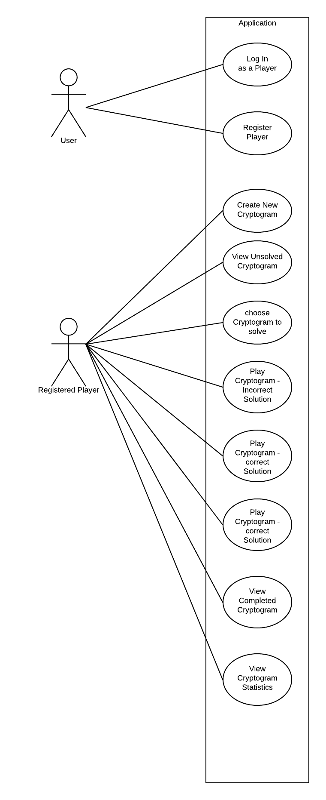

# Use Case Model

**Author**: Rushabh Bhansali (Team 48)

## 1 Use Case Diagram

The Use case diagram for the system is depicted below

## 2 Use Case Descriptions

### **2.1 Create Player**
- *Requirements: The user is able to register as a new player*
- *Pre-conditions: N/A*
- *Post-conditions: A new user will be generated and stored in the application database*
- *Scenarios:  1. The user launches the app.  2. The user clicks on **Create New User** on *user home* Screen. 3. The user enters **first name, lastname, unique user id and email** and clicks **Crete User**. *

### **2.2 User Login**
- *Requirements: The user must able to login as an existing player*
- *Pre-conditions: At least one user must have been created per 2.1 before attempting to login .*
- *Post-conditions: The player will be logged into the application as the selected user.*
- *Scenarios:  1. The user launches the app.  2. The user clicks on **Log in as Existing User** on *user home* Screen. 3. The user enters a **User Name** and clicks **Log In**. *

### **2.3 Create New Cryptogram**
- *Requirements: The player is able to create new cryptogram*
- *Pre-conditions: Use cases 2.1 and/or 2.2.*
- *Post-conditions: New cryptogram should be created.*
- *Scenarios:  1. The player selects **Create New Cryptogram** from **Player Home Screen**. 2. The player enters unique puzzle name, solution phrase, Max allowable solution attampts, and pairs of character substitutions  3. The player clicks **Save Cryptogram**.*

### **2.4 View Unsolved Cryptogram**
- *Requirements: The player is able to see unsolved Cryptogram*
- *Pre-conditions: There shoould be unsolved cryptogram in the app per use case 2.3*
- *Post-conditions: The player is able to see list of all the unsolved cryptogram by that player.*
- *Scenarios:  1. The player navigates to **Player Home Screen**. 2. Clicks on **List of Unsolved Cryptograms**.*

### **2.5 Choose Cryptogram to solve**
- *Requirements: The player should be able to choose any cryptogram that he has not solved or exceeded the maximum number of solution attempts**
- *Pre-conditions: Use case 2.4.
- *Post-conditions: The player is able to choose the unsolved cryptogram and navigated to **Solve Game** Screen.*
- *Scenarios:  1. Player selects any entry from the list of unsolved cryptogram.*

### **2.6 Play Cryptogram - incorrect solution**
- *Requirements: The player submits incorrect solution for the cryptogram**
- *Pre-conditions: Use case 2.5.*
- *Post-conditions: The application decrements the number of remaining attempts and calls attention to the new values with an on screen indicator.*
- *Scenarios:  1. On the **Solve Cryptogram** screen, the player selects incorrect replacement characters for the encoded phrase.  2. click **Check Solution** .   3. The ** Attempts Remaining ** field is decremented and an indicator icon is shown.

### **2.7 Play Cryptogram - correct solution**
- *Requirements: The player submits correct solution for the cryptogram**
- *Pre-conditions: Use case 2.5.*
- *Post-conditions: The application displays message indicating the correct solution attempt.*
- *Scenarios:  1. On the **Solve Cryptogram** screen, the Player selects correct replacement characters for the encoded phrase. 2. The player clicks on **Check Solution**.*   3. The player is redirected to the main screen and a message indicting success is displayed.

### **2.8 View Completed Cryptogram**
- *Requirements: The player is able to see Completed Cryptogram*
- *Pre-conditions: There may be zero or more completed cryptograms to list.
- *Post-conditions: The player is able to see list of all the cryptograms that he has completed.*
- *Scenarios:  1. The player navigates to **Player Home Screen**. 2. The player clicks on **List of Completed Cryptograms**.*  3. If there are any completed cryptograms for that user, they will be displayed.

### **2.8 View Cryptogram statistics**
- *Requirements: The player is able to see Cryptogram statistics.*
- *Pre-conditions: Use case 2.1 or 2.2.*
- *Post-conditions: The application displays the name, creation time, number of times the cryptogram has been solved, and the user names of the first three users to solve the cryptogram.*
- *Scenarios:  1. The player navigates to **Player Home Screen** . 2. The player then clicks on **Cryptogram statistics**.*  3. The player may click on any cryptogram (if any) and see the statistics as listed above.

