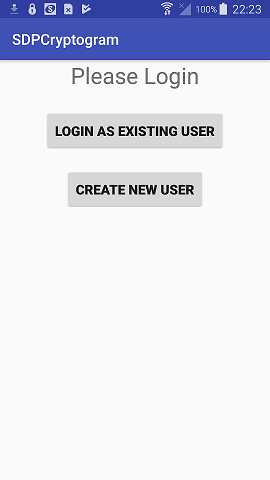
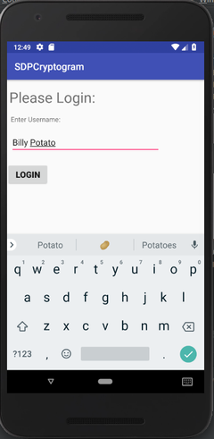
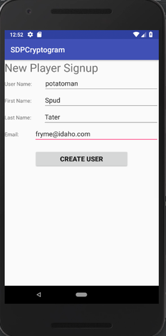
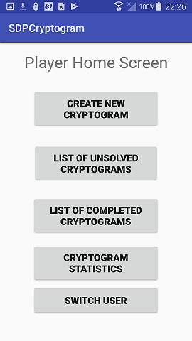
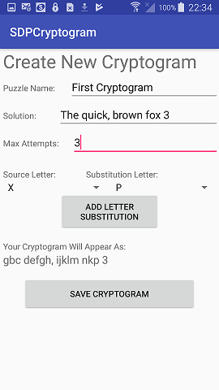
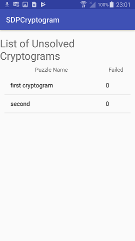
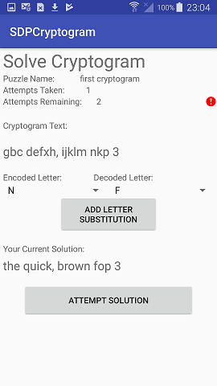
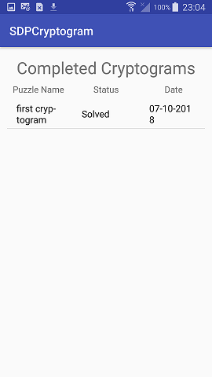
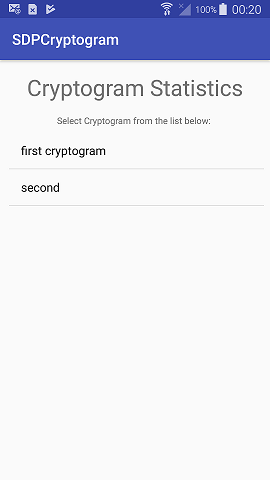
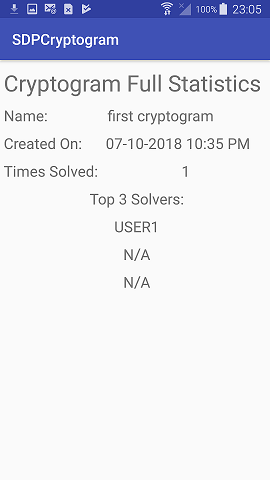

# User Manual - SDP Cryptogram - Team 48
#### Author - Rob Sylvester
##### Version 2

### Application Summary
In this application, users register for accounts and create and solve basic cryptograms that follow a substitution cipher. Additional limits are put on the number of attempts a user gets to solve a cryptogram. A lonely soul who finds themselves bereft of entertainment and activity in the world may choose to create additional accounts so that cryptograms may be solved over and over. In this document, we outline the procedures for creating/logging into the application, creating cryptograms, viewing the tables of cryptograms that are solved/unsolved, viewing cryptogram statistics, and the procedure for solving cryptograms. 

### Version Notes
The application is targeted at Android SDK 26, with a minimum SDK 23. This targets Android 6.0 (Marshmallow) at a minimum, so users running this application on an Android phone or emulator should keep this in mind.

# Usage Outline
##### User Accounts
When you open the SDP Cryptogram application, you must either login with a registered user name, or create a new account. There are no guest accounts. The user will be presented with two options, either to login as an existing user, or to create a new account:

1. **If you choose to login**, you will be presented with a single text box to enter your login name. There are no authentication systems in this simple application. If the username that is entered exists in the database, you will be logged in. If it does not, a simple error message will appear. The login page will appear as is pictured below:

1. **If you choose to create a new player**, you will be brought to a new screen where you will be asked to enter a username, a first name, a last name, and an email. The username **must be unique**, or the player creation will not be successful and an error will be shown. In addition, you must enter text for all four fields. The screen will be similar to the one pictured below. Once the new player has been created, you will be brought to the login screen. Note that there is no changing of passwords, emails, first/last names, or any of that. Such features are exclusive to the paid version of the app, in the form of teasing microtransactions woven between pictures of singles in your area!

##### Home
Once a user is logged in as a player account, they are brought to a home screen which they will use to navigate their way to all of the different interactions with cryptograms. A player may choose to create cryptograms, view lists of completed or incomplete cryptograms, or view statistics on cryptograms. These four options are presented with, well, four buttons:

It should be noted that any time a player wishes to get back to the home screen, they can use the back button on their Android device to return to this screen.

##### Creating Cryptograms
If the first option is selected from the home screen, the player will be brought to the cryptogram creation screen:

Creating a cryptogram has several parts, so let's discuss what each of these entries do.
1. **Unique Puzzle Name:** This will be the cryptogram name that is seen in the list when players are going through which cryptograms to solve or looking at statistics. It must be unique, and you cannot save your new cryptogram until you come up with something original! Note that these cryptogram names are **case insensitive**, which means that "PoTaTo" and "potato" will be counted as the same puzzle name!
1. **Solution Phrase:** This is where you enter what the decoded phrase will be in your cryptogram.
1. **Max Attempts:** This is how many attempts you give players to submit their solutions when attempting to solve your cryptogram. If they fail to solve it in this many tries, it becomes locked and is added to the 'Completed' list
1. **Character Ciphers:** The most difficult part of the application for users is the crytogram logic. The character ciphers are where you will pass your individual substitution cipher mappings. This means that if you choose the letter 'B' on the left spinner, and the letter 'D' on the right spinner, then every instance of the letter 'B' in your decoded phrase will be replaced with a letter 'D' in the 'encoded phrase'. To add this substitution, select the 'Add' button. Then, proceed forward and choose another substitution. Note that you are obviously limited to **26 substitution**, because that's how many letters are in the alphabet. Furthermore, if you choose to enter a duplicate substitution, such as additionally entering the letter 'E' for the letter 'B', then your previous substitution for that letter will be **overwritten** in place of the new one.
It should be stressed that if you are not careful with your creation that you can make **unsolvable cryptograms**, but the application will check for this to verify this and will not let your proceed. For example, consider the cryptogram "CAT", where the user replaces both the letters 'A' and 'T' with 'F'. Somebody playing this puzzle would see 'CFF', and at this point would be unable to substitute the letter 'F' for any single character, and this would make the cryptogram unsolvable.
1. **Check Encoded Phrase:** Just to make sure everything is how it should be with your character substitutions, after each substiution of characters you will see an updated display of your cryptograms encoded phrase. This is what the other users will see when they open your cryptogram.

1. **Save** When you're happy how it all looks, hit the 'Save Cryptogram button', and the Cryptogram will validate that the puzzle name is unique and add it to the list of unsolved cryptograms, as well as store it in the database for all other users to pay, I mean play.

##### List Unsolved Cryptograms
The application keeps track of a table of all listed cryptograms you have not solved, the number of failed attempts for each of the cryptograms, as well as some personal information on your loved ones. Users should use this list to **select which cryptogram they want to solve next**. The mockup is shown below. Click on of these cryptograms to enter the cryptogram solver.

##### Solving Cryptograms
Finally, the part you've all been waiting for, actually solving cryptograms! The cryptogram puzzle interface is shown below:

There's a lot going on here, so let's talk about it. You can see that there is an encoded phrase. This is what you're trying to solve. What you do is choose to source character and replacement characters, just like when creating cryptograms, and you will see displays of what your decoded phrase looks like. Note that if you replace a character, then all of the other characters in the encoded phrase will populate automatically to reflect this substitution. This should give you a good idea as to how you are doing as your solve your puzzle, and if your substitutions make any sense. Think of it like Wheel of Fortune, except you don't actually win anything, and it isn't really that fun. When you're happy with your guess, click the "Check Solution" button. You'll either have solved the cryptogram, or the counter on your remaining attempts will decrement, and a little focus box will let you know how many attempts remain, and have been taken. If you solve the cryptogram, you'll be taken back to the home screen and receive a happy little toaster message. If this counter reaches zero, you will have failed this cryptogram, people will laugh at you, and it will be added to the list of completed cryptograms, which we will explain...right now.

##### List Completed Cryptograms
Of course, the application also keeps track of the cryptograms that you can no longer play on your current account. This consists of both cryptograms that **you've successfully solved** as well as ones that you **failed to solve within the number of given attempts for that cryptogram**. The table in the mockup below shows a column, namely 'Status', that will let you know whether you were able to dominate that cryptogram with your wizardly prowess, or simply didn't have the necessary talent. Note that if you want to replay a cryptogram, you need to **make a new account**, or better yet, go outside and throw a baseball around with a friend.

##### Cryptogram Statistics
The cryptogram statistics table shows a list of all cryptograms, that is, the union of the sets of solved and unsolved cryptograms that appear in the previous two tables. The mockup is displayed here:

The most interesting part here is clicking on a given cryptogram to reveal some interesting information. Clicking on a cryptogram will bring up the following screen:

There is a great deal of information here. The info displayed will show the cryptogram name, its date of creation, the number of players who have successfully solved it, as well as the first three players to have solved it. You want to make sure to be one of the first three players to solve a cryptogram. If you are, there might just be a hidden secret in the application waiting for you (And more than likely, there won't be...there isn't).

#### A Note On Testing

The tests for the Database file, namely DB, are found in DatabaseTest in the androidtest folder. Likewise, the activity tests are found there. The activity tests are espresso tests, and they are thorough, and they require you to have an emulator open **with the power button turned on**. It will take time to run them, and you can do so individually, but watching them work is a good way not only to see tests but also for you to perhaps see how anything works if this document is confusing to you in some way. Note that Espresso of course interacts with the UI very, very quickly, entering phone characters at the base rate roughly eqivalent to that of a teenage girl texting on the freeway.

##### Just to Recap
It's all about the player home screen. If you didn't bring your trail of breadcrumbs with you into the journey of our application, and you find yourself lost, remember you can always just mash the back button on your Android device until you find yourself at the Player home screen. If you're unsure if your cryptogram is correctly encoded/decoded, remember that you can always view the encoded phrase. This will help you to ensure that the substitutions are properly done, and that any overlaps are handled properly. Finally, if you need to attempt a cryptogram for a second time, because you just weren't able to solve it the first time through, create a new account and attack it with confidence!

